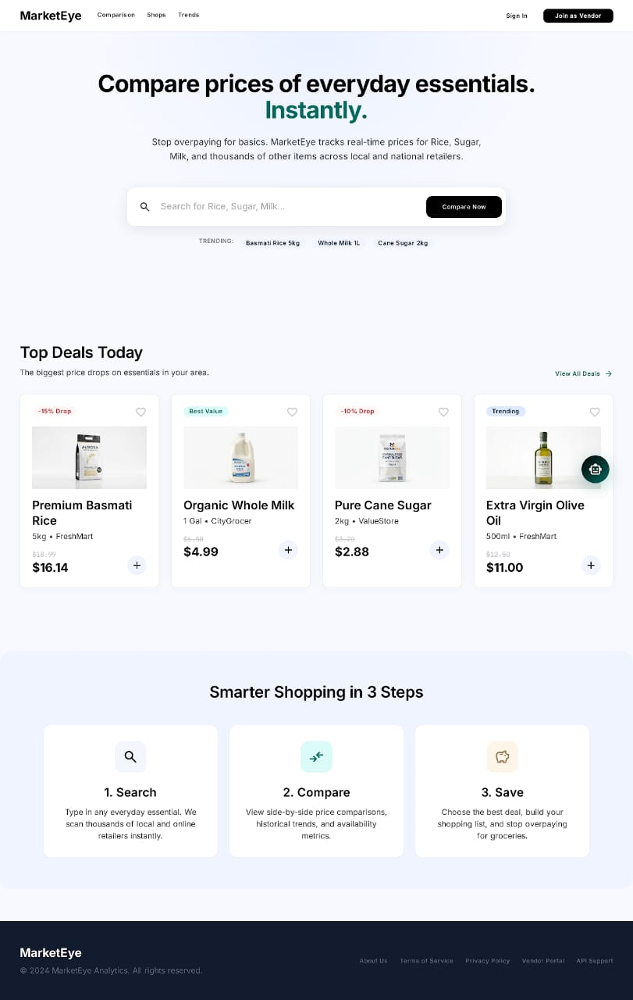
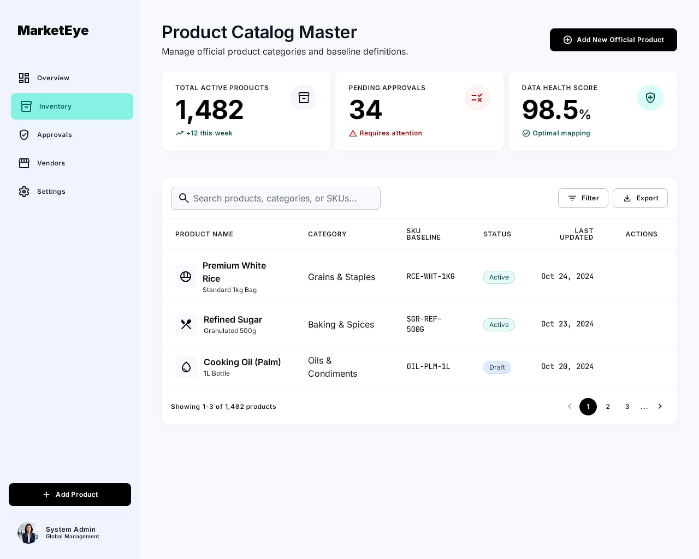
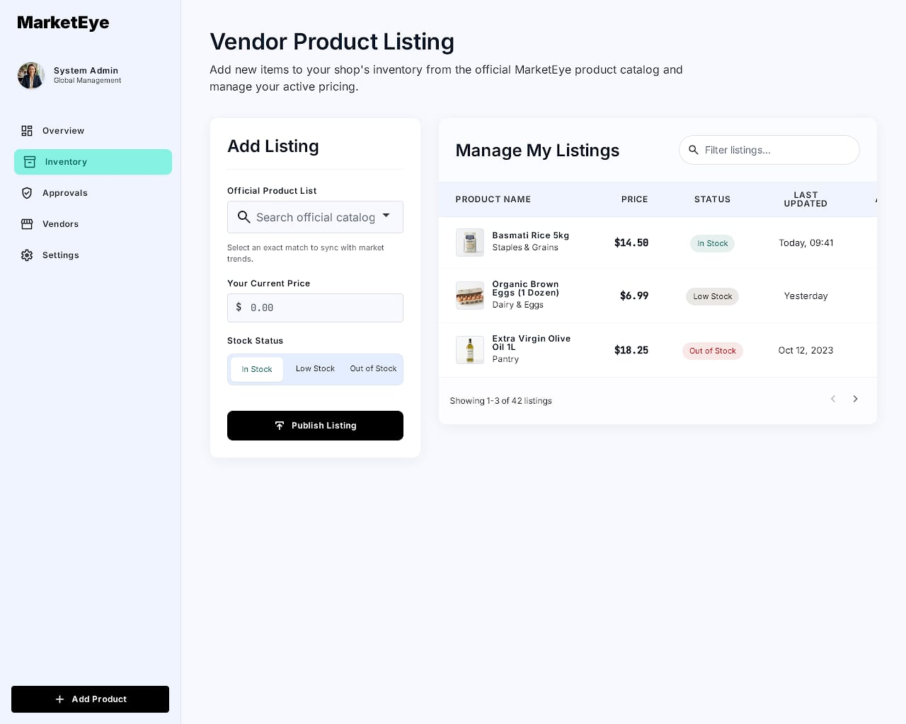
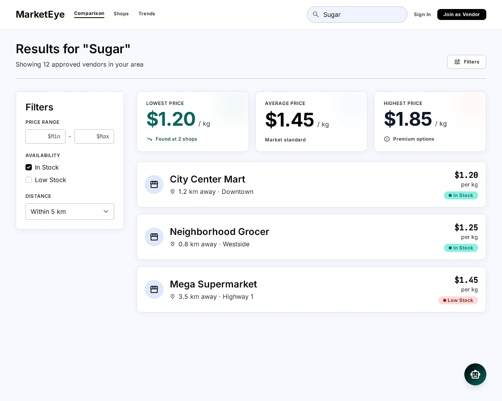
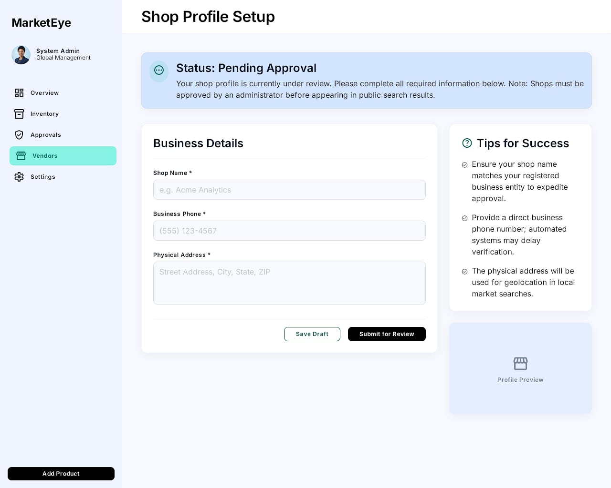

# Market Price Comparison & Product Availability System (AI-assisted)

**Live Demo:** https://frontend-production-c87c.up.railway.app/

## Overview
This project is a full-stack platform that helps users compare product prices across local shops and check product availability in real-time. It also provides AI-assisted recommendations to help users make better purchasing decisions.

Key capabilities:
- Cross-shop price comparison
- Real-time product availability (stock) status
- Role-based dashboards for customers and vendors
- AI assistant for suggestions and Q&A

## Why this project
It simplifies finding the best place to buy a product by aggregating listings from multiple vendors, tracking price changes, and surfacing availability information so users can save time and money.

## Repository structure
- `backend/` — Node.js + Express API server
- `frontend/` — React (Vite) single-page application and design assets

## Features
- Product price comparison across shops
- Product availability checks per shop
- Customer and vendor dashboards
- AI assistant (see `backend/controllers/aiController.js`) for conversational help and recommendations

## Tech Stack
- Node.js, Express
- MongoDB (see `backend/config/db.js`)
- React + Vite
- Gemini service integration (`backend/services/geminiService.js`)

## Local setup
1. Clone the repository:

   git clone <your-repo-url>

2. Start the backend:

```bash
cd backend
npm install
npm run start
```

3. Start the frontend:

```bash
cd frontend
npm install
npm run dev
```

4. Configure the database connection by updating `backend/config/db.js` with your MongoDB URI.

## How it works
- The frontend calls the backend API to fetch product listings, prices, and availability.
- The backend aggregates data from listings and shops, performs business logic, and uses an AI service for assistant responses.

## Screenshots
Design assets and screenshots are available in `frontend/Design/Screens` and included below:







## Important files
- `backend/server.js` — API entry point
- `backend/controllers/` — Request handlers and business logic
- `frontend/src/` — React application source

## Deployment
The app is deployed and accessible at:

https://frontend-production-c87c.up.railway.app/

## Contributing
Please fork the repository, create a feature branch, and open a pull request with a clear description of your changes.

## License
If a `LICENSE` file exists in this repository, refer to it. Otherwise, contact the project owner for licensing details.

---
_Prepared and polished by the project maintainer._

